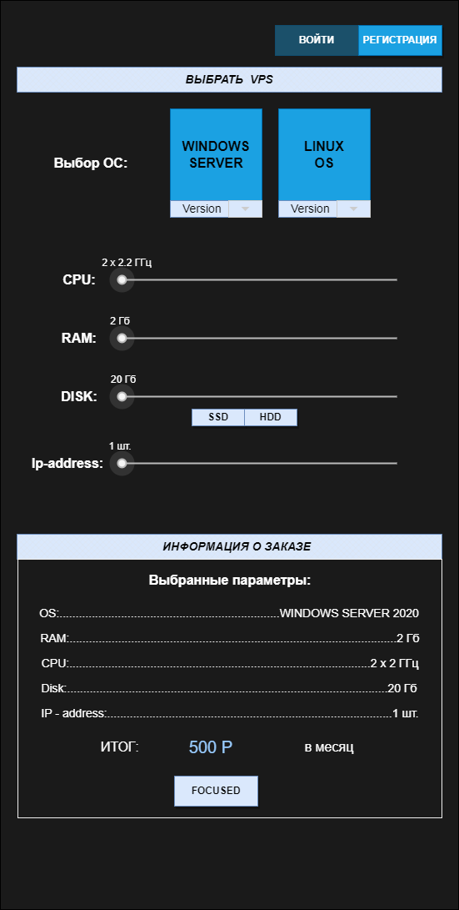
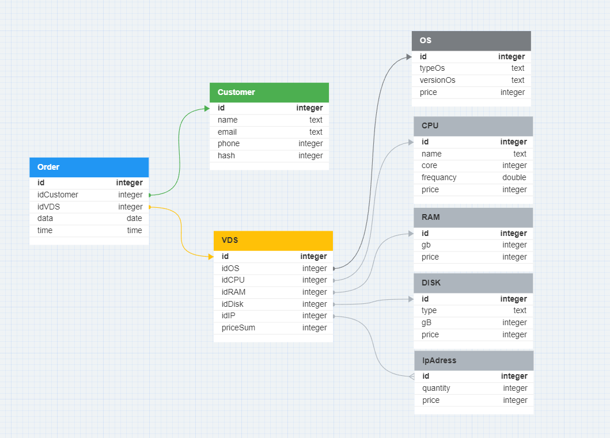

>**СЕМИНАР 9. Способы организации передачи данных между компонентами приложения, протоколы и API. REST, gRPC, очереди**

>**Домашнее задание:**
>* Разработать экранные формы интерфейса для заказа ресурсов в облачном сервисе
>* Разработать полную ERD домена
>* Дополнить swagger ответами домена (сутевые ответы) о статусе заказа ресурсов (создан, ошибка, нет ответа) и смоделировать ошибки REST «400, 500» типов.

> **Выполнение:**
> * Экранные формы:

> * ERD - диаграмма:

> [Json файл](https://github.com/Gregorian1489/HT009ARCHECTURE/blob/main/openapi.json)
